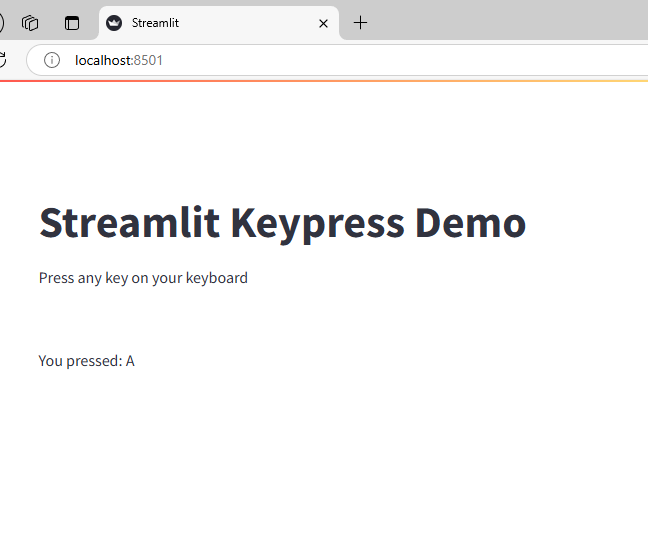

# Streamlit Keypress

A Streamlit component that captures keyboard **hotkeys** (e.g., `Ctrl+K`, `Cmd+Enter`) anywhere in your app and triggers your Python code **once per press**.

## Installation

```bash
pip install streamlit-keypress
```

## Quick start

```python
import streamlit as st
from streamlit_keypress import keyboard_input

st.title("Keyboard Hotkeys")

# Plain key
if keyboard_input("k"):
    st.write("You pressed: K")

# Ctrl/Cmd + K (two listeners for cross-platform)
if keyboard_input("k", ctrl=True):
    st.write("Ctrl+K")
if keyboard_input("k", meta=True):
    st.write("Cmd+K")
```



## Features

* Capture single keys or combos with modifiers (Ctrl, Alt, Shift, Cmd/Meta).
* Returns a **boolean pulse** (`True` exactly once) on a matching press.
* Defaults to **forbidding** unspecified modifiers to prevent false positives.
* Options for ignoring key auto-repeat, preventing browser defaults (e.g., `Ctrl+S`), and layout-independent matching with `KeyboardEvent.code`.

## Examples

### 1) Common hotkeys

```python
# Ctrl+K
if keyboard_input("k", ctrl=True):
    do_search()

# Cmd+Enter (macOS)
if keyboard_input("Enter", meta=True):
    submit()

# Shift+?
if keyboard_input("?", shift=True):
    open_help()
```

### 2) Allow or forbid modifiers

By default, all modifiers are **forbidden** unless you set them.
Pass `None` to **ignore** a modifier.

```python
# Detect "f" only when no modifiers are held (default behavior)
if keyboard_input("f"):
    st.write("Plain F")

# Detect "f" even if any modifier is held
if keyboard_input("f", ctrl=None, alt=None, shift=None, meta=None):
    st.write("F with any modifiers")
```

### 3) Cross-platform “Cmd/Ctrl” shortcut

```python
# Trigger on Cmd+K (mac) OR Ctrl+K (win/linux)
if keyboard_input("k", meta=True) or keyboard_input("k", ctrl=True):
    toggle_palette()
```

### 4) Prevent the browser’s default action

Stop the browser from intercepting combos like `Ctrl+S` or `Cmd+P`.

```python
if keyboard_input("s", ctrl=True, prevent_default=True):
    save_document()
```

### 5) Ignore key auto-repeat

Avoid multiple triggers while the key is held down.

```python
if keyboard_input("ArrowDown", ignore_repeat=True):
    move_selection(1)
```

### 6) Layout-independent physical key (`use_code=True`)

Match by `KeyboardEvent.code` (e.g., the **physical** “KeyK” key regardless of layout).

```python
# Triggers on the physical "K" key even if the character differs in current layout
if keyboard_input("KeyK", use_code=True):
    st.write("Physical K key pressed")
```

### 7) Multiple listeners on one page

Use a unique `widget_key` to bind each listener.

```python
if keyboard_input("1", widget_key="hotkey-1"):
    st.write("Hotkey 1")
if keyboard_input("2", widget_key="hotkey-2"):
    st.write("Hotkey 2")
```

## API

```python
keyboard_input(
    key: str,
    *,
    alt: bool | None = False,
    ctrl: bool | None = False,
    shift: bool | None = False,
    meta: bool | None = False,
    use_code: bool = False,
    ignore_repeat: bool = True,
    prevent_default: bool = False,
    widget_key: str | None = None,
) -> bool
```

* `key`: Target key. Examples: `"k"`, `"Enter"`, `"Escape"`, `"ArrowLeft"`.
  When `use_code=True`, pass codes like `"KeyK"`, `"Enter"`, `"ArrowLeft"` (see `KeyboardEvent.code`).
* `alt`, `ctrl`, `shift`, `meta`:

  * `True` → must be pressed
  * `False` (default) → must **not** be pressed
  * `None` → ignored (either state allowed)
* `use_code`: Match by `e.code` (physical key) instead of `e.key` (character).
* `ignore_repeat`: Suppress repeats while the key is held.
* `prevent_default`: Call `event.preventDefault()` on match to block browser default.
* `widget_key`: A Streamlit widget key so you can register multiple listeners.

**Return value:** `True` exactly once per matching press (edge-triggered). It auto-clears on the next rerun.

## Notes & limitations

* Browsers may reserve some shortcuts. Use `prevent_default=True` to keep the event for your app (where allowed).
* The web platform doesn’t support detecting two **non-modifier** keys pressed simultaneously as a single “combo” (e.g., `A+S`); combos are based on modifiers + one key.
* The component listens at the document level; the page/tab must have focus.

## Similar projects

- [streamlit-keypress] (legacy) — Original “keypress to Python” component by Sudarsan.
- [streamlit-shortcuts] — Keyboard shortcuts for buttons/widgets; supports multiple bindings and hints.
- [streamlit-keyup] — Text input that emits on every keyup (useful for live filtering).
- [keyboard_to_url (streamlit-extras)] — Bind a key to open a URL in a new tab.

[streamlit-keypress]: https://pypi.org/project/streamlit-keypress/
[streamlit-shortcuts]: https://pypi.org/project/streamlit-shortcuts/
[streamlit-keyup]: https://pypi.org/project/streamlit-keyup/
[keyboard_to_url (streamlit-extras)]: https://arnaudmiribel.github.io/streamlit-extras/extras/keyboard_url/

## Credits

This project is inspired by the original [streamlit-keypress] by **Sudarsan**.  
The implementation has since been significantly refactored and expanded (hotkeys, modifiers, preventDefault, `e.code` support).

## Contributing

Contributions are welcome—please open an issue or PR.

## License

MIT License. See `LICENSE`.
